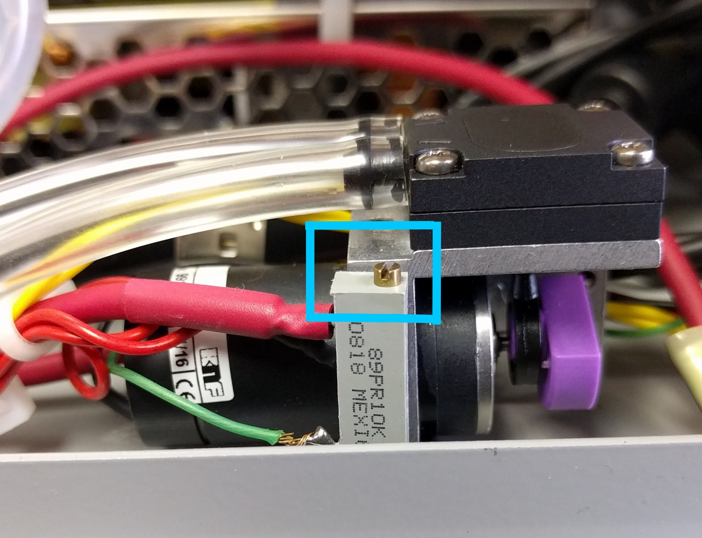

# Flow System

The PAS can be operated in two flow modes, "Pull Mode" (usually for aerosols) and "Push Mode" (usually for gases).  A flow diagram for the PAS is shown below.

```{r echo=FALSE, fig.align='center'}
knitr::include_graphics("./images/flowDiagram.png")
```

## Pull Mode
Pull Mode is recommended for normal sampling of aerosols and situations in which the sample is at ambient atmospheric pressure.  In pull mode, the PAS uses an internal pump to pull sample through the instrument.  In this mode, the sample is connected to the "Sample In" port on the control box (Point A).  From there, it passes through a software-controlled valve to enter or bypass a HEPA filter for background measurement.  It then exits the control box via the "Sample Out to PAS" port (Point B) and enters the PAS.  An acoustic filter separates the PAS from downstream equipment.  After leaving the optical block, the sample line re-enters the control box via the "Pump In" port (Point E).  Points C and D are the ports through which the flow enters and exits the optical block enclosure.  The flow is set by a flow limiting orifice under critial flow conditions.  A 0.2 micron filter is placed directly after point E to protect the flow-limiting orifice and pump from particulates.

<center>
```{r out.width=50, echo=FALSE}
knitr::include_graphics("./images/warning_generic.png")
```
</center>
> ***The pump may be damaged by certain chemicals.  Therefore, it is recommened to only use the pump for air or with adequate chemical scrubbers inline before the pump.***

A trim-pot is located on the pump inside the control box.  If the PAS is not reaching it's desired flow, the trim-pot may be adjusted to compensate.  Use a nut driver to remove the front panel and then use a screw driver to adjust the potentiometer attached to the pump just inside the front panel.  The pump trim-pot is outlined in blue below.

<center>
```{r out.width=500, echo=FALSE}

```
</center>

## Push Mode
Push Mode is recommended for calibrations with nitrogen dioxide and when sampling other high-pressure samples.  In this mode, the pressure and flow must be regulated externally from the PAS using, for example, a pressure regulator and mass flow controller.  An maximum flow rate of < 450 SCCM (standard cubic centimeters per minute) must be maintained to avoid turbulent flow.

> *Flows > 450 SCCM may cause excessive noise and/or overload the microphone!*

The flow-regulated sample is connected directly to the PAS optical block enclosure (Point C) and the exhaust is vented appropriately (e.g. to a fume hood) through point D.  Note that the control box is entirely bypassed.
