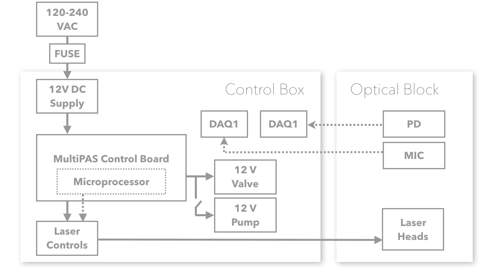

#  {-}
<center>
***MultiPAS-III/IV***

*Multi-laser photoacoustic spectrometers*

```{r echo=FALSE, fig.align='center'}
knitr::include_graphics("./images/multiPAS.png")
```

&copy; 2018 Al Fischer/Smith Lab/University of Georgia
</center>

<!--chapter:end:index.Rmd-->

# Safety Information
Certain aspects of this instrument may pose a risk to the user, bystanders, and personal property.  This section provides an *overview* of potential hazards, and more detail is provided within the manual body.  Follow all applicable laws regarding laser operation and hazardous materials when working with the instrument.

## Symbol Defintions

The following symbols indicate a potential hazard:

```{r out.width='50px', echo=FALSE}
knitr::include_graphics("./images/warning_generic.png")
```
**General hazard to person or instrument:** This symbol indicates a potential safety hazard. Take care to avoid personal injury and/or damage to the instrument.

```{r out.width='50px', echo=FALSE}
knitr::include_graphics("./images/warning_laser.png")
```
**Laser radiation hazard:** This symbol indicates a potential laser radiation hazard.  Take care to avoid exposure to the laser beam(s) and wear eye protection if appropriate.

```{r out.width='50px', echo=FALSE}
knitr::include_graphics("./images/warning_highVoltage.png")
```
**Electrical shock hazard:** This symbol indicates a potential electrical shock.  Ensure the instrument is unplugged before continuing.

## Personal Safety Information
This instrument contains visible and invisible class 3b diode lasers operating at UV, visible, and/or infrared.  Direct eye or skin contact with the beam(s) may cause permament personal injury!  Avoid direct eye contact with the beam and wear safety goggles of appropriate optical density when necessary!  Avoid placing hands in the laser beam(s)! Be weary of wearing rings, watches, or other reflective objects that may cause erratic reflections when working in the beam.  Likewise, be careful of reflections from tools that may be placed in the beam.

The control box for this instrument contains 120 VAC wiring.  Ensure the instrument is unplugged before opening the control box for maintenance!

## Instrument Safety

The lasers in this instrument are *very* sensisite to optical feedback.  Extreme care should be taken to avoid back reflections entering the laser aperture.  Back reflections entering the laser aperture may destroy the laser diode and require purchase of a new laser head.  The instrument is equipped with Faraday isolators and bandpass filters to avoid back reflections, and operating the instrument without these in place may cause permanent damage.

The PAS contains custom optics that may be easily scratched and dirtied.  Use extreme care when handling optics and follow proper cleaning protocols.

The microphone uses a fiber optic cable that can be permanently damaged if bent of smashed.  Handle with care.

<!--chapter:end:01-safetyInformation.Rmd-->

# Connecting the Instrument

The MultiPAS consists of two primary components: (1) the optical block and (2) the control box.  Both the sample and signals flow between the two components, requiring the two to be connected both hydraulically and electrically.  The two components should be placed near each other on a flat, level, vibration- and sound-free surface.


```{r echo=FALSE, fig.align='center'}
knitr::include_graphics("./images/pasOverview.png")
```

## Connecting the Control Box
1. Pass the electrical umbilical through the hole in the PAS case and connect the three SDR cables to the back of each laser; note the color code on the cables.
1. Connect the photodiode to the **Photodiode** connection on the control box with a coaxial cable via the BNC connections.  Also connect the photodiode to the supplied +/-12 V power supply via the threaded, 3-pin connector.

     ```{r out.width='60px', echo=FALSE, fig.align='center'}
knitr::include_graphics("./images/warning_highVoltage.png")
     ```

    > *Ensure the appropriate mains voltage is selected on the photodiode power supply before plugging it in.*

1. Connect the microphone amplifier to the back of the control box with a standard 3.1 mm audio cable via the audio jacks.
1. Connect the **Sample In** barb on the back of the control box to the sample source (e.g. ambient air or simulation chamber).  This is the sampling point.
1. Connect the **Sample Out to PAS** barb on the back of the control box to the **Sample In** barb on the PAS case.
1. Connect the **Sample Out to Pump** barb on the PAS case to the **Pump In** connection on the control box.

    > *The preceeding three steps are only used when the PAS is operating in "pull mode", that is, pulling sample into the instrument.  For "push mode" (e.g. when sampling from a gas cylinder) and further information regarding flows, see the chapter on the PAS flow system.*

1. Connect the control box to a computer via the USB-B connection on the back of the control box.  *Note: the USB connection powers the microprocessor inside the control box; the processor remains on as long as the USB cable is plugged in*.
1. Plug the control box into the while with a three prong mains cord via the power entry module on the back of the box.  The main circuitry remains off until the power switch at the cord is switched on.

## Connecting the Microphone
Follow all instructions in the OptiMic manual (supplied separately) when using the microphone.

1. Connect each prong of the fiber optic to the microphone amplifier via the bayonet connectors. The two connections are interchangeable.
1. Uncoil the minimum amount of fiber optic cable necessary, safely route it to the PAS, and *gently* slide the microphone into the Ultra-Torr connector on the microphone.

     ```{r out.width='60px', echo=FALSE, fig.align='center'}
knitr::include_graphics("./images/warning_generic.png")
     ```

    > ***The microphone can be permanently damaged if the fiber optic cable is bent or crushed!***

1. Tighten the Ultra-Torr connector until *just* sealed.  Even slightly over-tightening the connector can result in permanent microphone damage, but undertightening can result in a leak and/or erratic signal.

     ```{r out.width='60px', echo=FALSE, fig.align='center'}
knitr::include_graphics("./images/warning_generic.png")
     ```
     
    > ***The yellow region on the microphone body indicates the region most easily damaged by excessive force.  Use extreme care when inserting the microphone!***

1. If not already complete, plug the microphone into the appropriate connection on the rear panel of the control box using a 3.1 mm audio cable.

1. Plug the microphone amplifier into a 120 VAC outlet using the supplied 5V power supply. The green LED on the microphone should illuminate.  You may need to turn the microphone on via the switch on the amplifier, set the noise reduction to zero via the second switch, and set the desired volume.

<!--chapter:end:02-connectingTheInstrument.Rmd-->

# Quick Start

This section outlines the basic steps needed to start sampling with the PAS for the first time and after it has been turned off.  It assumes the instrument has been connected according to [Chapter 2](connecting-the-instrument.html).

## Installation
1. Download or locate and install the following third-party software:
    - [LabVIEW run time engine](http://www.ni.com/download/labview-run-time-engine-2016/6067/en/) 2011 (National Instruments)
    - [WaveIO](https://www.zeitnitz.eu/scms/waveio) (Christian Zeitnitz)
    - OBIS Connection (supplied on USB flash drive, Coherent, Inc.) 
1. Locate the [MultiPAS-III](https://github.com/alphonse/MultiPAS-III/tree/master/exec) (3 wavelengths) or [MultiPAS-IV](https://github.com/alphonse/MultiPAS-IV/tree/master/exec) executable.
1. Connect the USB cable to the computer and let Windows install the necessary drivers.
1. Open OBIS Connection to determine the COM ports for the lasers, listed by wavelength on the left side of OBIS Connection.  Write down for use in the LabVIEW program.

## Powering On
1. Switch the main power on by moving the switch on the rear of the control box to the on position ("|").
1. Open the Optical Block case with the latches on the front.
1. Ensure the laser supplies have illuminated indicators.  If necessary, turn their power switches to on.
1. Open the laser apertures by sliding the knurled slider on top of the laser heads in the Optical Block case.
1. Ensure the microphone is plugged in to it's DC power supply and it's green LED is illuminated.  Turn the switch on if necessary.
1. Turn the photodiode power supply on via the switch on the power brick.  Turn the photodiode on via the switch on the side of the sensor; the green light should illuminate.
1. Remove the photodiode's lens cap if necessary.
1. Close the case.
1. Turn the pump on by switching on the "**Pump**" switch on the front of the control box to begin pulling sample through the instrument.

## Using the Software

1. Open the "**MultiPAS-III.exe**" control program, which should start automatically. *Note: If COM ports have been changed, or a new computer is used you may have to stop the program and select the correct COM ports (written down during "Installation", above) in the first tab of the UI.*
1. Type your calibration coefficient into the appropriate box in the *Calibration* Tab to display quantitated absroption data.  See the [Calibration](calibration.html) chapter for more information.
1. Turn the lasers on by pressing *All Emit*.  Alternatively, individual lasers can be turned on and off with the buttons for each laser. You should see three peaks near 1370 Hz in the FFT plots under both the *Microphone* and *Photodide* tabs.
1. To save data, click the **Save** button and follow the dialog prompts to use the default file location or select your own.
1. To automatically collect background spectra, select **Auto Filter** on the main panel of the UI. Under this setting the control box will automatically cycle between HEPA filtered air (background) and sample, and will perform frequency sweeps in between.  You may set the sample time (time between filters) and background time (time for the filter and frequency sweep) to the desired time, but 24 minutes and 6 minutes are, respectively, the default and suggested values.

## Powering Off
1. Press the **Exit** button on the main panel of the LabVIEW program.  Lasers will turn off automatically. *NOTE: This is the only recommened way of stopping the software.  Using other methods (e.g. LabVIEW's stop sign button) may cause errors.*
1. Open the Optical Block and turn off the photodiode and microphone.  If the PAS will not be used for a while and/or to avoid dust contamination, replace the lens cap on the photodiode and slide the knurled shutter sliders on the laser to the closed position.  Close the Optical Block case.
1. Turn off the main power switch on the PAS Control Box.
1. Turn off the photodiode power supply.
1. Unplug the USB cable.  *NOTE: The main microcontroller will remain powered and continue to run while the USB cable is plugged in, regardless of the main power switch position.*

<!--chapter:end:03-quickStart.Rmd-->

# Calibration

The PAS should be calibrated periodically against a standard gas mixture or a cavity ringdown spectrometer to account for the sensitivity of the cell acoustic response and microphone.  By measuring a known abosrption of NO$_2$ and comparing the measured PAS signal to the known absorption, the cell constant can be determined.  A standard mixture of NO$_2$ may be obtained from a specialty gas supplier (such as [Airgas](https://www.airgas.com/)) or made quantitatively in a lab with appropriate capabilities.^[[A Sensitive and Versatile Detector for Atmospheric NO2 and NOX Based on Blue Diode Laser Cavity Ring-Down Spectroscopy](http://pubs.acs.org/doi/abs/10.1021/es902067h)
Hendrik Fuchs, William P. Dubé, Brian M. Lerner, Nicholas L. Wagner, Eric J. Williams, and Steven S. Brown
Environmental Science & Technology 2009 43 (20), 7831-7836
DOI: 10.1021/es902067h]  A stock concentration of 1-10 ppm is suggested.  The flow rate uncertainties dominate the total error on the PAS measurements; thus, care should be taken to select appropriate flow control devices such as to minimize uncertainties on the flow rates.  The recommended calibrant is NO$_2$.

## Setup
1.  Connect the regulator to the standard NO2 cylinder and connect to the flow control and measurement device(s) compatible with NO$_2$ (e.g. a mass flow controller or rotameter).  Flows will be in the 5-100 SCCM; select a flow controller accordingly.
1.  Connect the outlet flow to one side of a standard $\frac{1}{4}$" T-connector with PTFE tubing.
1.  Connect an N$_2$ source (e.g. a liquid nitrogen dewar, 22 psi/50 liter) to a CGA 580 regulator and then to a flow control and measurement device.  Flow will be 100-300 SCCM; select device accordingly.
1.  Connect the N$_2$ line to the other side of the T-connector.
1.  Connect the third port on the T-connector to the inlet on the PAS Optical Block (i.e. [Push Mode](file://localhost/Users/al/Dropbox/manual_MultiPAS/_book/flow-system.html#push-mode), do NOT go through the control box).
     ```{r out.width='60px', echo=FALSE, fig.align='center'}
knitr::include_graphics("./images/warning_generic.png")
     ```
     
    > ***The tubing, filters, and pump inside the PAS control box can be damaged by NO$_2$!***

## Calibration Procedure

*Note: The following guidelines work at 785 nm but can be adjusted to acheive the appropriate absorption for the wavelength used.  For example, the absorption cross section is an order of magnitude higher at 660 nm, so nitrogen flows would increase and NO$_2$ flows would decrease to acheive absorption in the 1-100 Mm$^{-1}$ range desired.  NO$_2$ cannot be accurately measured with photoacoustic methods below 420 nm.*

1.  Set the N$_2$ flow to 100 SCCM and purge the PAS for 10-15 minutes.
1.  After purging with nitrogen, conduct a frequency sweep to measure the resonance frequency and set the modulation source.  The resonance frequency for a cell filled with nitrogen is typically 1395-1400 Hz.  After the sweep is complete, turn off all lasers except the 782 nm diode.
1.  Record $I_0$ values in the calibration calculator spreadsheet.  Enter the measured powers at this time, as well.
1.  Open the NO$_2$ cylinder and set the flow to ~1000 SCCM for roughly 30 seconds; this allows NO$_2$ to equillibrate in the system and begin to passivate the tubing.
1.  Set the NO$_2$ flow to 200 SCCM.
1.  Once the PAS microphone signal is stable, record the value in the calibration calculator spreadsheet.
1.  Set the NO$_2$ flow to 150 SCCM and repet the above step.
1.  Repeat the above two steps until you have measured 200, 150, 100, 75, and 50 SCCM flows of NO$_2$.
1.  The slope for the calibration is typically ~100,000 V/W-cm.  Enter the calculated value into the LabVIEW program in the **Cell Calibration** box.

<!--chapter:end:04-Calibration.Rmd-->

# Data Processing

The MultiPAS system outputs two types of files during autonomous running: (1) the `pas.txt` tab-separated document containing both the raw and processed data for the PAS and (2) text files in the `sweeps` folder containing a record of each frequency sweep conducted.  Although the main data file contains data that has been processed in real time, it is recommeneded that data is post-processed from the raw data prior to publication.  Although data can be processed in any scientific computing or spreadhseet software, an [R](https://www.r-project.org/about.html) package, `aeRo`, has been developed to aid in data processing and is available via [GitHub](https://github.com/).

## Processing Data with R

The R package `aeRo` has been developed (or rather, is currently under development) to aid in processing MultiPAS data with R.

R is open-source and freely available from the [R Project for Statistical Computing](https://www.r-project.org/).  If using R, [RStudio](https://www.rstudio.com/products/rstudio/download/), an open-source and freely available IDE for R, is *highly* recommened for ease of using R.

### The aeRo Package

The first step to processing data in R is to install `aeRo`.  The package `devtools` will be needed to install aeRo from the command line.

```{r install-packages, message=FALSE, warning=FALSE}
# Install the devtools package and then load it
options(repos="http://archive.linux.duke.edu/cran/") # not necessary if installing from 
# RStudio's package manager
install.packages('devtools')
library(devtools)

# Now, use it to install aeRo and then load aeRo
install_github('alphonse/aeRo')
library(aeRo)
```

You can see the functions available in `aeRo` by clicking on its name in the "Pacakges" tab within RStudio, executing `help(package = aeRo)`, or with the `ls()` command.

```{r ls-aero}
ls('package:aeRo')
```

More information on any command can be obtained by typing a question mark followed by the command.  For example, the help file for `importPAS` is found with `?importPAS`.

### Loading data into R
To load data into R, first call `importPAS()` and then subset and align the data via the graphical display to the start index of the first filter period using `chooseFilterStart`.  `chooseFilterStart` requires user input to the console based on the values selected on the plot.  Alternatively, if the start index is already known, you may use the argument `graph = FALSE` and `start = index` to bypass the graphical selector.  The function will also make the data length a multiple of `period`.

```{r import, message=FALSE}
library(dplyr)
setwd("/Volumes/CHEM/Groups/Smith_G/MultiPAS-IV/ambient/20170303")
pas <- importPAS('pas.txt', no.cols = 18) %>%
  # chooseFilterStart()  ## typically uncommented, for graphical interface
  chooseFilterStart(graph = FALSE, start = 1430) # only used when start point
  #  is already known, comment otherwise.
```

### Exploring MultiPAS Data

The PAS outputs a tab-separated text file of the raw and processed MultiPAS data.  Columns are named according to the content, with the convention Ch1 = shortest laser wavelength.  

```{r explore}
# Display a few rows as an example
head(pas)
```

As seen in the above snippet, the data file contains the following columns (18 total):

1. **Time:** Sample time in the non-ambiguous UNIX/POSIX time standard, 'YYYY-MM-DD HH:MM:SS'.
1. **micCh1_mV -- micCh4_mV:** The raw microphone signal in mV for each channel; if only 3 channels are present Ch4 will be filled with '0'.
1. **pdCh1_mV -- pdCh4_mV:** The raw photodiode signal in mV for each channel; if only 3 channels are present Ch4 will be filled with '0'.
1. **tau_sec:** The ringdown time in seconds; for systems without a CRD, will be filled with '0'.
1. **babsCh1_Mm -- babsCh4_Mm:** The real-time absorption in 1/Mm for each channel; if only 3 channels are present Ch4 will be filled with '0'.
1. **bextCh1_Mm:** The real-time exticntion in 1/Mm for each channel; if no CRD is present no extinction is measured and column will be filled with '0'.
1. **fres_Hz:** The resonant frequency in Hz used during each sampling period.
1. **filter_state:** A boolean indicating whether the filter is out (`0`) or inline (`1`).
1. **elapsedTime_min:** The elapsed time in minutes since the start of the last filter; displays the maximum value during the frequency sweep.

### Processing The Data
With `aeRo`, data can be processed by stringing together a few functions.

```{r process, warning=FALSE, message=FALSE}
# Calculate powers, backgrounds, and tau_0, and add to main data.frame
pas <- cbind(pas, getBg(pas)) %>%
  cbind(averagePower(pas)) %>%
  cbind(tau0_s = getTau0(pas$tau_sec))

# Convert data to absorption & extinction
pas <- cbind(pas, convertToAbs(x=pas[, 2:5], bg=pas[, 19:22], p=pas[, 23:26], m=114000)) %>%
  cbind(ext662_Mm = convertToExt(pas$tau_sec, pas$tau0_s))
# Set background periods to NA for cleanliness in plotting
pas[which(pas$filter_state == 1 | pas$elapsedTime_min > 23.5 | pas$elapsedTime_min < 2.0), 28:32] <- NA
# Add rolling average via "zoo" pacakge, but exlude NAs
library(zoo)
pas[!is.na(pas$abs406_Mm), 28:32] <- rollmean(na.exclude(pas[, 28:32]), k = 120, fill = NA)
```

### Plot data
`aeRo` includes a plot class specifically for absorption data: `plot.abs()`.   Argruments can be passed to `plot()` to change the look of the plot.

```{r plot}
plot.abs(x = pas$Time, y = pas[, 28:32])
```

Further functions for calculating AAE, SSAs, etc., are forthcoming.

<!--chapter:end:05-dataProcessing.Rmd-->

# Flow System

The PAS can be operated in two flow modes, "Pull Mode" (usually for aerosols) and "Push Mode" (usually for gases).  A flow diagram for the PAS is shown below.

```{r echo=FALSE, fig.align='center'}
knitr::include_graphics("./images/flowDiagram.png")
```

## Pull Mode
Pull Mode is recommended for normal sampling of aerosols and situations in which the sample is at ambient atmospheric pressure.  In pull mode, the PAS uses an internal pump to pull sample through the instrument.  In this mode, the sample is connected to the "Sample In" port on the control box (Point A).  From there, it passes through a software-controlled valve to enter or bypass a HEPA filter for background measurement.  It then exits the control box via the "Sample Out to PAS" port (Point B) and enters the PAS.  An acoustic filter separates the PAS from downstream equipment.  After leaving the optical block, the sample line re-enters the control box via the "Pump In" port (Point E).  Points C and D are the ports through which the flow enters and exits the optical block enclosure.  The flow is set by a flow limiting orifice under critial flow conditions.  A 0.2 micron filter is placed directly after point E to protect the flow-limiting orifice and pump from particulates.

<center>
```{r out.width='50px', echo=FALSE}
knitr::include_graphics("./images/warning_generic.png")
```
</center>
> ***The pump may be damaged by certain chemicals.  Therefore, it is recommened to only use the pump for air or with adequate chemical scrubbers inline before the pump.***

A trim-pot is located on the pump inside the control box.  If the PAS is not reaching it's desired flow, the trim-pot may be adjusted to compensate.  Use a nut driver to remove the front panel and then use a screw driver to adjust the potentiometer attached to the pump just inside the front panel.  The pump trim-pot is outlined in blue below.

<center>
```{r out.width='500px', echo=FALSE}
knitr::include_graphics("./images/pumpTrimPot.jpg")
```
</center>

## Push Mode
Push Mode is recommended for calibrations with nitrogen dioxide and when sampling other high-pressure samples.  In this mode, the pressure and flow must be regulated externally from the PAS using, for example, a pressure regulator and mass flow controller.  An maximum flow rate of < 450 SCCM (standard cubic centimeters per minute) must be maintained to avoid turbulent flow.

> *Flows > 450 SCCM may cause excessive noise and/or overload the microphone!*

The flow-regulated sample is connected directly to the PAS optical block enclosure (Point C) and the exhaust is vented appropriately (e.g. to a fume hood) through point D.  Note that the control box is entirely bypassed.

<!--chapter:end:06-flowSystem.Rmd-->

# Electrical

<center>
```{r out.width='50px', echo=FALSE}
knitr::include_graphics("./images/warning_highVoltage.png")
```
</center>
> ***Unplug all power before any electrical work on the PAS or opening the control box!***

A genralized diagram of the PAS electrical system is shown below.  Some components, such as photodiodes and the microphone, may require external power supplies, but the majority of the components are powered directly via the PAS control box.

```{r echo=FALSE, fig.align='center'}

```

The heart of the PAS electrical system is the Teensy 3.6 (PJRC.com) microcontroller that resides on the MultiPAS control board.  The Teensy communicates with the software to control the modulation of the lasers and switch the background valve on and off.  The same board distributes 12 V power to the system.  The MultiPAS control board may be used with both 3- and 4-wavelength versions of the PAS.  Three-wavelength versions may have a Teensy 3.2 instead of the 3.6 shown on the schematic; these are, however, mostly drop-in compatible.

```{r echo=FALSE, fig.align='center'}
knitr::include_graphics("./images/electricalSchematic.png")
```

<!--chapter:end:07-Electrical.Rmd-->

# Maintainance

## HEPA Filter Replacement
The PAS Control Box contains a Pall HEPA filter capsule used during background measurements.  See the [Flow System](file://localhost/Users/al/Dropbox/manual_MultiPAS/_book/flow-system.html) chapter for more information.  This filter may need to be replaced periodically. To replace the filter:

1. Unplug the control box, remove the front and rear panels using a 1/4" nut driver, and then remove the screws on the bottom of the control box and lift the top off.  The filter will be immediately visible.
1.  Note the orientation of the flow arrow on the filter, then disconnect the tubing from the barbed fittings on either end of the filter and slide the filter out from under the zip tie.
1.  Remove the barbed fittings on either end of the old filter, remove and replace the PTFE tape on them, and install them on the new filter.
1.  Slide the filter into the zip tie fastener that held the old filter.  Ensure the filter is in the same orientation as the old one.
1.  Replace the tubing on the 1/4" barbs on either side of the filter.
1.  Replace top, front, and rear panels of control box.

## Protection Filter Replacement
The protection filter protects the orifice and pump from particulates.  It may need to be replaced periodically.  To do so:

1. Unplug the control box, remove the front panel using a 1/4" nut driver.
The filter is behind the pump and infront of the power supply.  It is a small green or purple disc.
1. Remove the filter from the attached tubing and replace with a standard 0.2 $\mu$m Luer-lock syringe filter.
1. Replace front panel.

## Cleaning the Orifice
The flow of the PAS is limited by an orifice.  If it becomes clogged it may be cleaned.  To clean the orifice:

1. Unplug the control box, remove the front panel using a 1/4" nut driver.
The orifice is behind the pump and infront of the power supply, just downstream from the protection filter.  It looks like a small section of stainless steel tubing.
1. Remove the orifice from the attached tubing and note the orientation.
1. Place the orifice in a beaker of diluted laboratory detergent (e.g. Alconox), acetone, or isopropyl alcohol.  Cleaning successively in each (in that order) will likely provide the best results.
1.  Place the beaker in an ultrasonic cleaner for 5-10 minutes.
1.  Rinse with deionized water and dry thoroughly.
1.  Reinstall into the tubing inside the control box; the open side should go toward the PAS (high pressure) and the closed side toward the pump (low pressure).
1.  Reinstall the front panel.

## Cleaning the Optics
Thor Labs lens paper ([MC-5](https://www.thorlabs.com/thorproduct.cfm?partnumber=MC-5)) and spectrophotometric grade methanol are recommended for cleaning most optics in the PAS.

## Cleaning the PAS
Ocassionally, aerosols may dirty the inside of the PAS.  An unusally high background signal indicates the PAS needs to be cleaned.

1. Remove the PAS from the breadboard, being careful when disconnecting the tubing and microphone.
1. Remove the baseplate of the PAS.
1. Remove the windows and all fittings on the PAS.  ***NOTE: The windows are custom coated and are very fragile! Use extreme caution when removing them, being sure equal tension is kept across the surface of the window (i.e. do not tighten or loosen any screw more than the others).***
1.  Clean the inside of the PAS with laboratory detergent and a soft brush.
1.  Rinse with acetone and/or isopropyl alcohol.
1.  Rinse with deionized water.
1.  Bake in an oven at 105$^{\circ}$C for one hour or until thoroughly dry.
1.  Reinstall fittings and window, being careful not to overtighten or unevenly tighten the fasteners on the windows.  Reinstall the PAS baseplate, and install on the breadboard.

## O-ring Replacement

The PAS has o-ring seals on the inlet and outlet, around the microphone, on the windows, on all other ports on the cell body, and between the main resonantor channel and end caps.  These o-rings should be replaced periodically or when worn.  They may be *very lightly* greased with vacuum o-ring grease prior to installation to assist in sealing and prolong o-ring life.

## Fuse Replacement
The PAS contains two fuses in the power entry module on rear panel.  To replace them, unplug the PAS, remove the sliding fuse holder just above the plug and replace with round 5 mm, 20 A fuses.

## Realignment


### Multipass Cell

The multipass cell consists of two cylindrical mirrors.  The cell will need tuning and alignment periodically.  The alignment may be adjusted by changing the parallelism of the mirrors via the alignment knobs on either the front or rear mirror mount; it can also be adjusted by changin the relative orientation of the cylindrical cross sections of the mirrors via the rotation ring on the front mirror.

To align the cell from scratch:

1. Ensure all lasers are off.
1. Remove the microphone from the cell.   Be careful not to damage the fiber optic cable on the mircrophone!
1. Disconnect the inlet and outlet tubing from the cell.
1. Remove the PAS screw by removing the four philips-drive screws holding it to the breadboard.
1. Turn on the green laser and click the "Alignment Mode" button in the software to set the laser power to 5 mW
1. Ensure the beam is passing through the hole in the front mirror; the small x and y adjustment knobs on the front mirror mount may be used to adjust the mirror relative to the beam.
1. Use the adjustment knobs on the back mirror to steer the beam until roughly 5 spots are observed on the back mirror.
1. Rotate the front mirror until a dense pattern of spots is observed.
1. Fine tune the alignment and rotation by maximizing the effective power read by the photodiode.

### Beam Steering Optics and Lasers

The beam steering optics are fixed relative to each other via the cage system.  If the cage system moves or must be removed, it is usually possible to place it back in the correct spot simply by aligning it such that the lasers beams pass through the hole in the front mirror (assuming the lasers have not moved).

*Warning: The proceeding to the techniques listed below may require complete disassembly and realignment of the PAS!*

If the lasers have moved relative to each other and the horizontal alignment is off, they may be adjusted by loosening the 1/4-20 hex-drive screws holding them to the breadboard and adjusting the angle of each laser.  Keeping the screws tight enough to maintain high tension on the laser and tapping the mount gently to move it helps make fine adjustments.  Adjust the angle until the beams are colinear and pass through the hole in the front mirror.  This will only affect the x (horizontal) alignment.

If the vertical alignment is off, especially for the inner lasers, the problem is likely a misaligned dichroic.  To adjust, remove the rear lens cap from the appropriate dichroic cube and tighten or loosen the screws holding the dichroic mount in the cube with a ball-end metric hex driver. Make small adjustments to steer the beam up or down.  If necessary, a nylon washer may be placed under one side of the mounting plate by removing the entire cube and dissassembling it.  Ideally, this alignment only affects the y (vertical) positioning, but the adjustment process might also affect the horizontal alignment.

<!--chapter:end:08-maintainance.Rmd-->

# Troubleshooting

## Common Software Errors
1. *VISA Read/Write: Device not found.*  Either the incorrect COM ports have been selected or the USB communication has frozen.  In the case of the latter, exit LabVIEW completely and reset the PAS by turning off the main power switch on the control box *and* disconnecting the USB cable.  Reconnect and restart.
1. *VISA Read/Write: Device is valid but VISA cannot open it.*  Another program is communicating with one of the PAS's components.  Close other programs and restart LabVIEW.
1. *Valve will not switch and/or frequencies will not change.*  USB communication broken -- exit LabVIEW completely and reset the PAS by turning off the main power switch on the control box *and* disconnecting the USB cable.  Reconnect and restart.
1. *WaveIO Device Not Found.*  Known bug with unknown cause.  To fix, stop the program, increase the PD and mic device ID's (under the Utilities tab) by 1 and start the program.  Then, stop the program, set them back to their original values and start the program again.  The errors should go away after the final restart.
1. *Extremely fast aquisition (x-axis) on PD or mic plots.*  See *WaveIO Device Not Found*, above.

## Common Hardware Errors
1. *No Signal or Excessive Noise.*  Excessive noise or a cancellation of signal may occur if:
    - *There is an opening on the PAS cell.*  Make sure the inlet and outlet are attached to the control box, a gas line, or plugged; check all fittings on the PAS cell to ensure they are tight.
    - *The pump is not set correctly or the orifice is missing.* Lower the pump speed with the trim pot on the pump and check that the orifice is in place.
    - *The flow rate is too high.*  Lower the flow rate.
1.  *High Background.*  The cell may be dirty.  See [Cleaning the PAS](maintainance.html#cleaning-the-pas).
1.  *Low Laser Powers.*  Low laser power may be observed if:
    - *The multipass alignment is bad.*  [Align](maintainance.html#realignment) the multipass cell.
    - *The optics are dirty.* [Clean the optics.](maintainance.html#cleaning-the-optics)
    - *The optics are misaligned* Go through the [realigment](maintainance.html#realignment) procedure.

<!--chapter:end:09-Troubleshooting.Rmd-->

